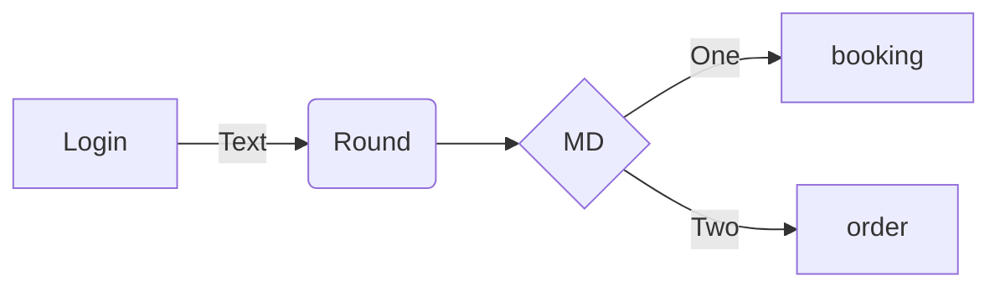
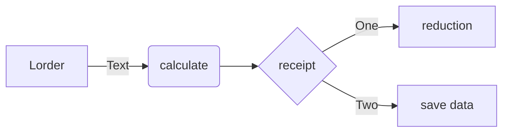

# restaurant_project_643450063-8

ความเป็นมาของโปรแกรม

เนื่องจากผมต้องการไปกินอาหารที่ร้านผมเลยว่าร้านอาหารสมัยนี้ควรทำงานยังไง ผมจึงคิดการคำนวนการจองในร้านอาหารเพื่อความสะดวกสะบายที่การซื้อขายด้วยความรวดเร็ว และเหตุผลอีกอยากคือการป้องปกจากเชื้อไวรัสโควิด-19อีกด้วย ดังนั้นผมจึงทำโปรแกรมนี้ขึ้นมา ครับ

วัตถุประสงค์ของโปรแกรม

เพื่อการ ระบุยืนยันตัวตนและการคำนวนโดยอัตโนมัติเพื่อรวดเร็วและความสะดวกสบายอีกด้วย

 ClassDiagram

ชื่อของผู้พัฒนาโปรแกรม

นาย กมล จันบุตรดี 643450063-8
